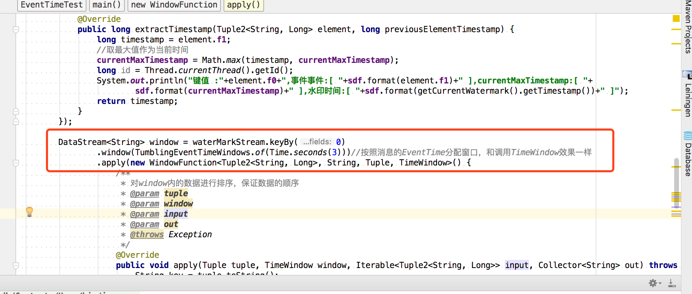
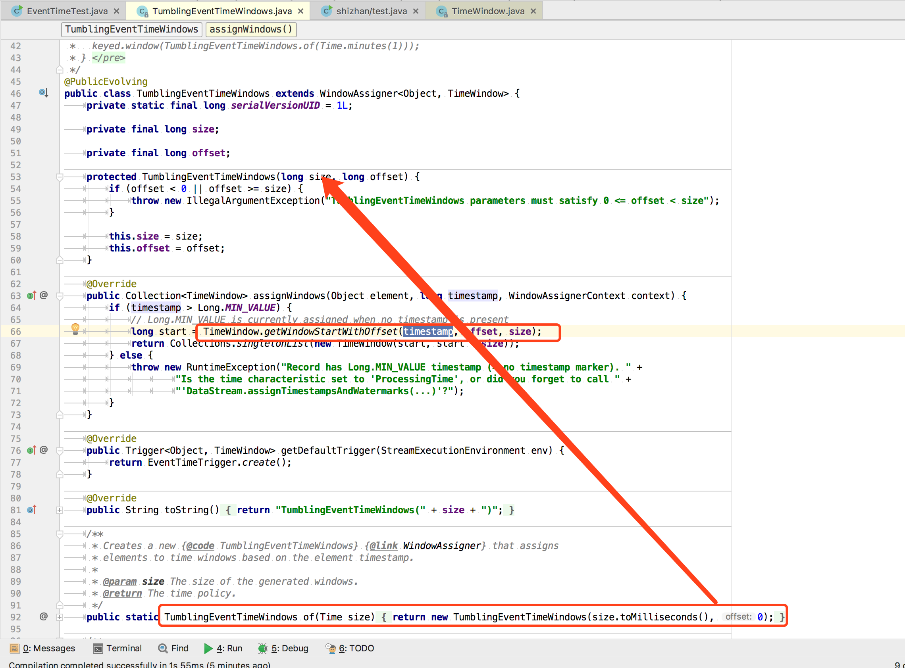
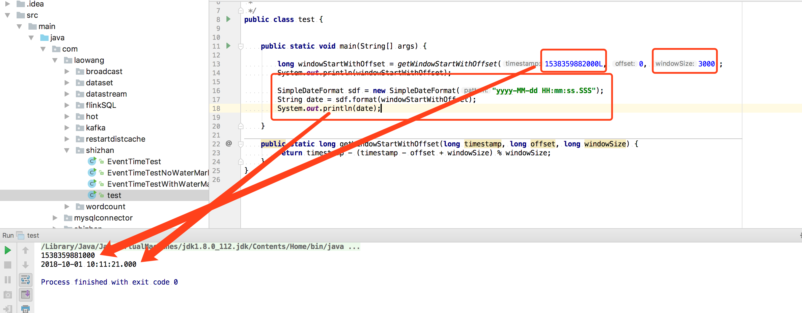
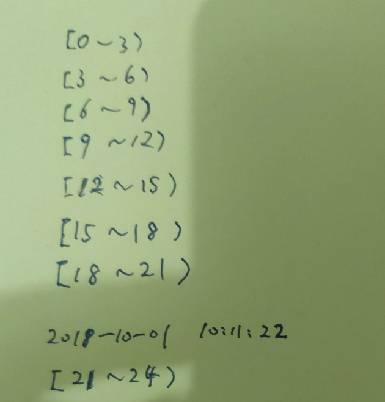
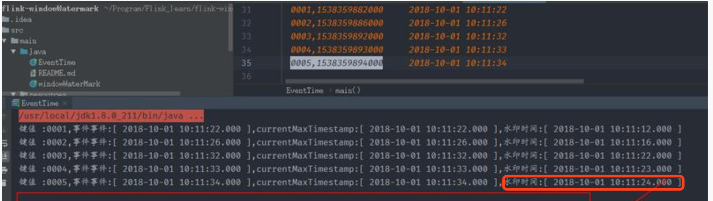

窗口和水印是Flink中最重要的知识点之一，也是最难理解的部分。

首先要明确2个问题：

1. watermark时间>= window_end_time时，才会触发窗口执行。也就是我们所说的窗口的左闭右开原则；

2.下面这段代码意思是3秒创建一个滚动窗口，形如：[0,3) [3,6) [6,9)...  窗口的偏移量为0(窗口的起始时间点)。

DataStream<String> window = waterMarkStream.keyBy(0)
        .window(TumblingEventTimeWindows.of(Time.seconds(3)))
        .apply(new WindowFunction<Tuple2<String, Long>, String, Tuple, TimeWindow>()

那么提问中的两个问题我们一一解决：

第一个问题：为什么第一个窗口的起始时间是2018-10-01 10:11:21.000？

看下面的图：

我们最终会调用到

TimeWindow.getWindowStartWithOffset(timestamp, offset, size);
这个方法的实现为：

public static long getWindowStartWithOffset(long timestamp, long offset, long windowSize) {
   return timestamp - (timestamp - offset + windowSize) % windowSize;
}
看到了吧，也就是说我们的一系列连续的EventTime生成时间窗口的时候是上面的这个方法算出来的。

那我们第一个窗口为什么是2018-10-01 10:11:21.000，我们用这个方法试验一下，大家看图：

注意时间类型都是Long型的毫秒值

我们把第一个数据的EventTime时间戳传进去：

1538359882000
然后发现得到的结果是：1538359881000 正好就是：2018-10-01 10:11:21.000

那么到此为止第一个问题就解决了，有没有更好的办法判断窗口，其实很简单，看下图：

既然我们的窗口是3秒，偏移量是0，那么窗口从0秒开始生成就是图中所示，正好[21,24) 这个窗口将第一个数据包含进来了，所以窗口的起始秒就是21，再把年月日时分补全就得到：2018-10-01 10:11:21.000。

第二个问题：为什么输入的数据到第五个才开始触发窗口计算？

还记得上面的原则吗？watermark时间>= window_end_time时，才会触发窗口执行。

图中，

2018-10-01 10:11:24.000 这个水印时间产生的时候，正好触发了我们第一个生成的窗口[2018-10-01 10:11:21.000,2018-10-01 10:11:24.000).也就是：2018-10-01 10:11:24.000这个时间点。

不知道看到这里，你对水印和窗口的机制更了解了没有？这块内容确实比较难以理解。多看源码，多跑demo。