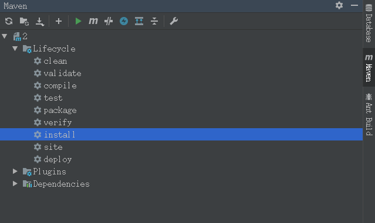
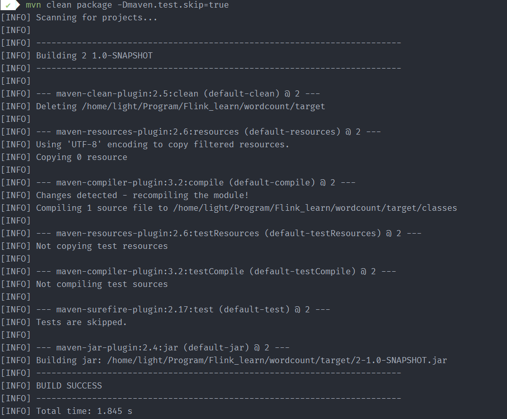
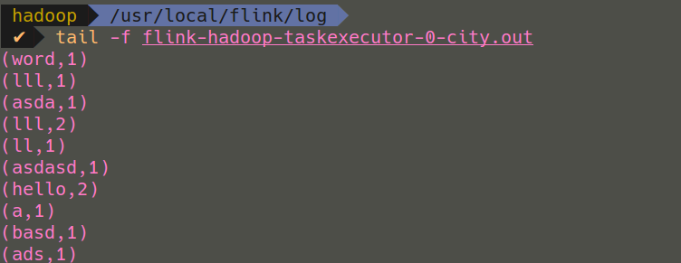
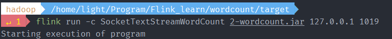
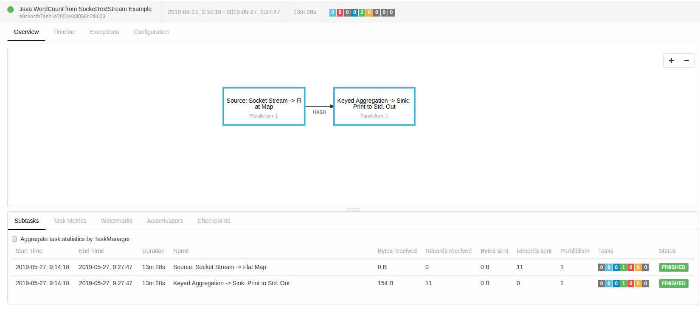

# 使用Maven构建Flink第一个项目

## 0.准备工作

下载Flink并运行！

## 1.IDEA创建Maven项目

点击左上角File->new Project->后面直接点击下一步->GroupID与artifactId、version随便填写->填写项目名称，点击完成。

**注意：**Maven打包后的`jar`包名字就是我们`artifactId-version.jar`格式，可以适当根据喜好在`pom.xml`修改。

`pom.xml`修改：

```xml
<dependencies>
    <dependency>
        <groupId>org.apache.flink</groupId>
        <artifactId>flink-streaming-java_2.11</artifactId> <!--2.11为scala.binary.version-->
        <version>1.7.2</version> <!--Flink版本号-->
    </dependency>
</dependencies>
```

点击`import change`即可。

新`java class`命名为：`SocketTextStreamWordCount`。

填写下面代码：

```java
import org.apache.flink.api.common.functions.FlatMapFunction;
import org.apache.flink.api.java.tuple.Tuple2;
import org.apache.flink.streaming.api.datastream.DataStreamSource;
import org.apache.flink.streaming.api.datastream.SingleOutputStreamOperator;
import org.apache.flink.streaming.api.environment.StreamExecutionEnvironment;
import org.apache.flink.util.Collector;

public class SocketTextStreamWordCount {
    public static void main(String[] args) throws Exception {
        //参数检查
        if (args.length != 2) {
            System.err.println("USAGE:\nSocketTextStreamWordCount <hostname> <port>");
            return;
        }

        String hostname = args[0];
        Integer port = Integer.parseInt(args[1]);


        // set up the streaming execution environment
        final StreamExecutionEnvironment env = StreamExecutionEnvironment.getExecutionEnvironment();

        //获取数据
        DataStreamSource<String> stream = env.socketTextStream(hostname, port);

        //计数
        SingleOutputStreamOperator<Tuple2<String, Integer>> sum = stream.flatMap(new LineSplitter())
                .keyBy(0)
                .sum(1);

        sum.print();

        env.execute("Java WordCount from SocketTextStream Example");
    }

    public static final class LineSplitter implements FlatMapFunction<String, Tuple2<String, Integer>> {

        public void flatMap(String s, Collector<Tuple2<String, Integer>> collector) {
            String[] tokens = s.toLowerCase().split("\\W+");

            for (String token: tokens) {
                if (token.length() > 0) {
                    collector.collect(new Tuple2<String, Integer>(token, 1));
                }
            }
        }
    }
}
```

## 2.编译与运行

> Maven打包

第一种方式，进入`pom.xml`同级目录，输入：`mvn clean package -Dmaven.test.skip=true `

上述表示：**不但跳过单元测试的运行，也跳过测试代码的编译。**

另外一种方式，使用IDEA左边的Maven直接`install`即可打包。





最终看到`BUILD SUCCESS`就成功了。

> nc 命令

`nc` 是一款功能类似 `cat` 的工具，但是是用于网络的。它是一款拥有多种功能的 CLI 工具，可以用来在网络上读、写以及重定向数据。

输入：`sudo nc -l 1019 ` 

上述`1019`为端口号。

> 运行jar包

`flink run -c SocketTextStreamWordCount 2-wordcount.jar 127.0.0.1 1019  `

需要配置环境变量flink或者进入flink的bin目录下运行，输入程序类名、jar包包名、端口号。

在nc处向端口发送数据，进入flink的log目录查看log日志，可以看到flink的统计结果。








问题：**中文与特殊字符不能统计**。

上述学习参考自：http://www.54tianzhisheng.cn/2018/09/18/flink-install/
